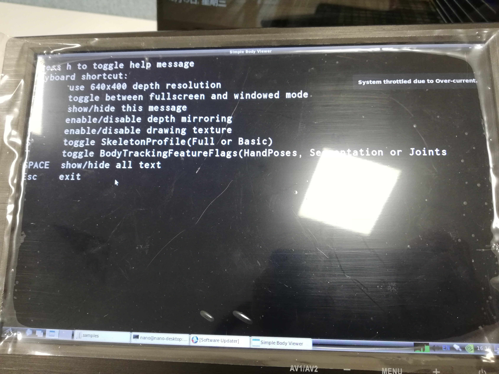
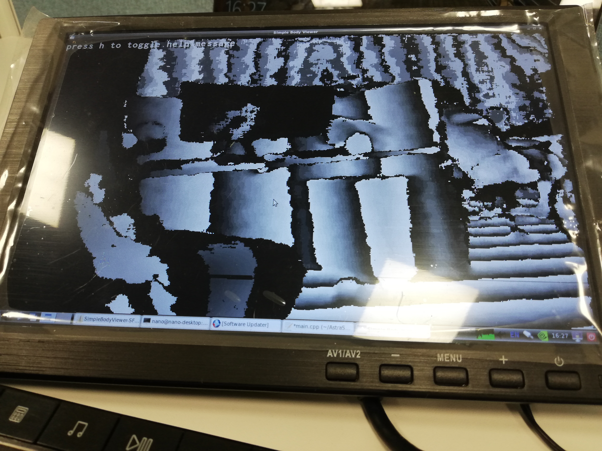
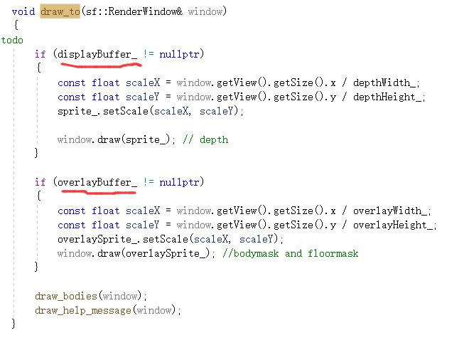
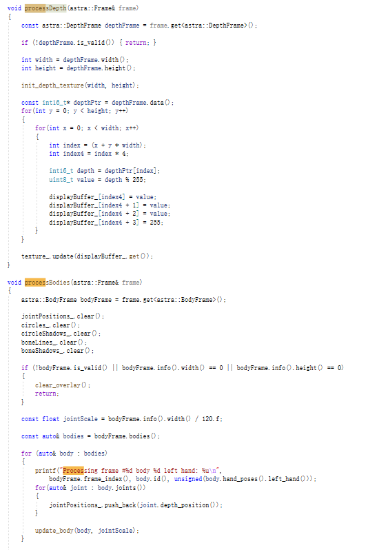
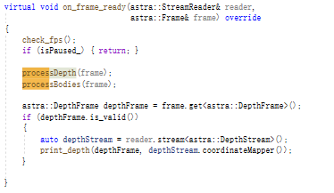
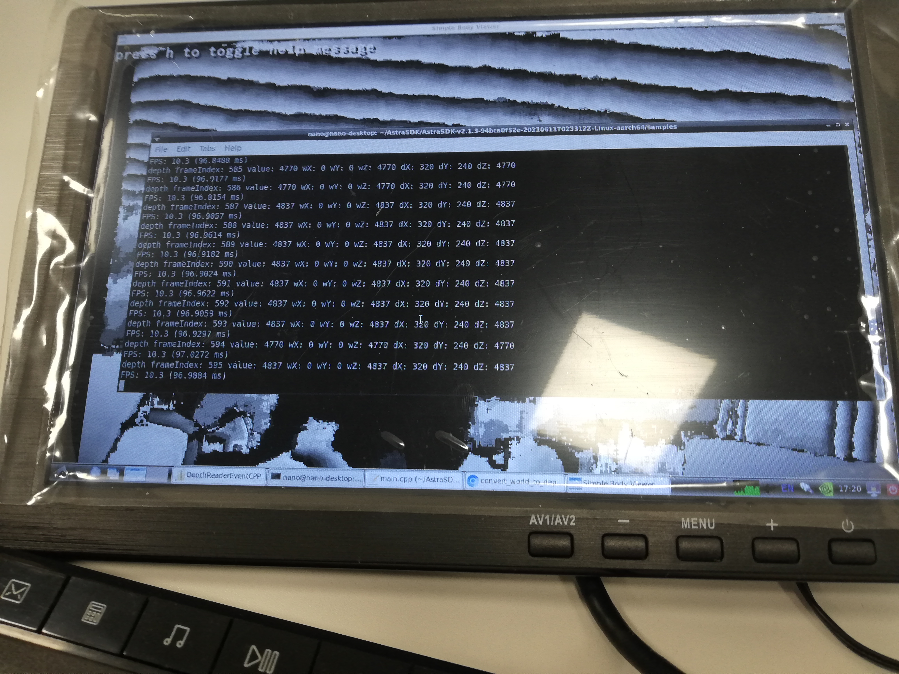
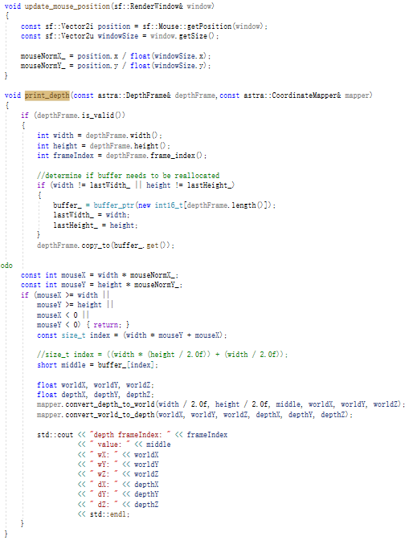

# 基于机器狗的危险行为预警及看护
-------------------

- 张淘月 

- 叶顶强 

- 王志越

- 本项目为南方科技大学计算机科学与技术专业创新实践项目，指导老师为于仕琪老师。

- 项目目前进度及效果可见视频：https://www.bilibili.com/video/BV1Wh41127wu?from=search&seid=331279642344468380

--------------------------------

### 项目简介

随着当前社会老龄化以及3D计算机视觉技术的蓬勃发展，智能看护是技术改变生活中一个非常好的应用。

本项目通过使用深度摄像机获取场景的RGB-D信息，并提取其中人体骨架信息。通过对人体骨架关键点的分析来判断当前目标状态，并根据目标关键点三维坐标信息实现跟踪。最终实现对目标的跟踪及看护功能，当识别到目标的危险行为（如跌倒等）时进行报警。

使用设备：奥比中光AstraPro、云深处绝影mini

目前存在的问题：

- 人体骨架识别准确率不够
- 对于危险行为的识别精确率不足
- 由于硬件问题出现的明显识别帧数过低

优化方向：

- 之前的骨架识别方法使用openpose开源库以rgb作为训练数据，将识别结果映射到深度图中获取深度数据。因此考虑将深度也作为识别时的训练数据提高识别准确率
- 通过GCN-MSG3D优化方法提高识别准确率
- 将运算部分移植至云端，机器狗本身只负责数据采集、传输及根据处理结果进行对应行为

---------------------------------

### 实现简介

##### 机器狗

本次项目使用云深处绝影mini，其内置毫米波雷达、realsence深度摄像机以及三台主机，其中一台负责控制感知部分。所以在机器狗内置识别和处理运算时会出现过热导致的处理帧数不足。

##### 深度摄像机

奥比中光AstraPro使用结构光原理，因此精度和帧率都较高但因为原理原因无法在强光环境下使用。

##### 识别结果

目前可识别目标简单动作以及发生意外的情况。

### 项目进度

##### 10月8日-10月13日

1.在使用Astra SDK的过程中，发现彩色图可以显示，但是人体骨架识别的深度图无法显示。

对深度图显示进行BUG修复，修复流程如下：

首先对数据流进行排查，考虑到是深度图，因此对摄像头的深度信息获取进行测试，结果发现，深度信息能够正常获取到。

因此对人体骨架识别的深度图中，对人体骨架信息流进行排查。结果发现，当取消人体骨架信息流的传递之后才能够正常显示深度图。

人体骨架信息流用于视频中绘制人体骨架，因此，对绘制部分的代码进行排查，经排查，发现深度图信息绘制的缓冲区(displaybuffer_)以及人体骨架信息绘制的缓冲区(overlaybuffer_)没有数据。

发现displaybuffer_与overlaybuffer_的数据来源于processDepth和processBodies方法，而这两个方法均用于on_frame_ready方法进行每帧传输数据。

而on_frame_ready的实现具体是由Astra SDK的动态链接库定义，无法进行修改。因此之后计划向Astra SDK相关负责人反应BUG的问题。而目前也因为无法通过Astra SDK来获取人体骨架信息而只能获取深度信息图。计划之后采用openpose或自行设计算法进行人体骨架识别。

2.修改深度图源代码，使得系统获取视频流中鼠标所指位置的深度信息。具体实现是通过修改主函数中监听来获取鼠标所指位置的深度信息。

##### 10月1日-10月7日

1.购买TF卡用于NANO开发板系统安装与数据存储，购买网卡，但网卡仅适用于WINDOWS系统，NANO开发板是使用LINUX系统，因此无法使用网卡。

2.安装LINUX系统于开发板上，并安装Astra SDK。安装流程参考NVIDIA Jetson Nano 2GB 系列文章。安装效果如图所示：

